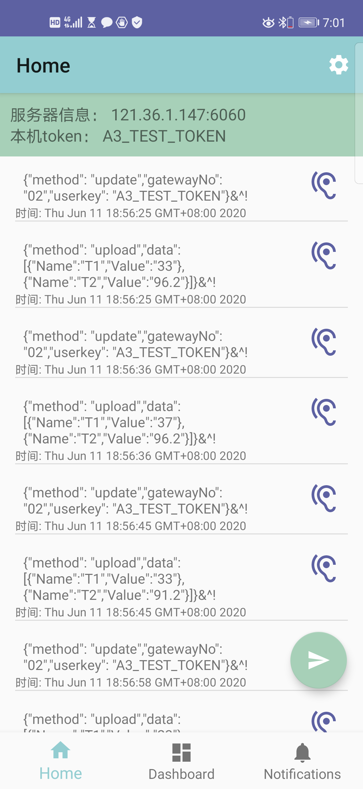
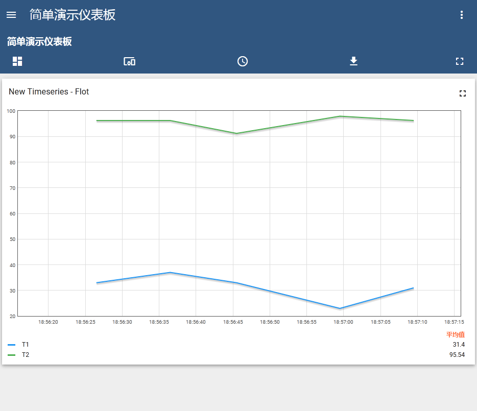

写了一组程序简单模拟了一下设备上传的流程：

## 1. 一个android的app用来模拟设备
可以按照[乐联文档](https://www.lewei50.com/dev/doc/176)中指定的格式来模拟设备通过**Raw TCP**来上传数据。使用两个请求，
- 一个是“发送登录注册信息”，形如  
```
{"method": "update","gatewayNo": "02","userkey": "6f289b7f11084520bd2aad8e425ee9b4"}&^!
```
在app上模拟时不需要手动发送，每次自动发送。

- 一个是发送具体数据，形如：
```
{"method": "upload","data":[{"Name":"T1","Value":"33"},{"Name":"T2","Value":"96.2"}]}&^!
```
可以在app上每次修改手动发送的数据的值

App截图如下


## 2. 一个协议转化程序  
相当于一个协议适配器，部署在一台linux服务器上，将设备发送的数据转化成thingsboard可以接受的形式。


## 3. 私有化的部署了一个thingsboard后台
- 访问路径： http://121.36.1.147:8080/login
- 用户名： tenant@thingsboard.org

然后创建了一个仪表板，该仪表板可以实时更新设备“Test Device A3”对应的“T1”和“T2”两个指标数据。通过android app模拟设备“Test Device A3”，可以看到仪表板上的数据的实时变化：
